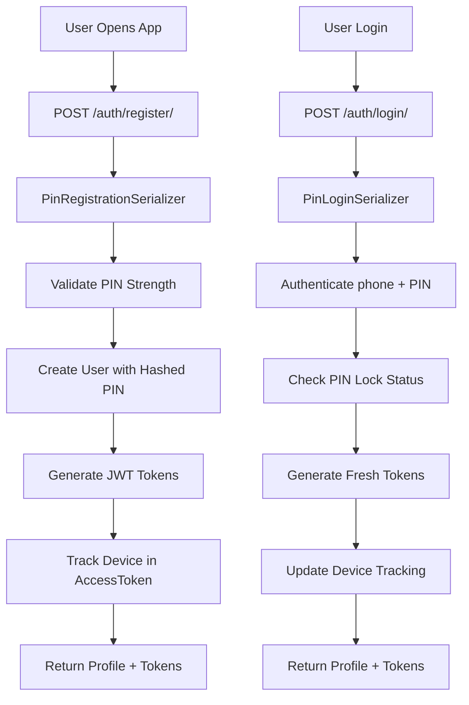

## 🏗️ **Overall Architecture Overview**

This system implements a **PIN-based authentication architecture** that completely replaces traditional password authentication, designed for mobile-first applications with comprehensive user management capabilities.

## 🔄 **Core Authentication Flow**

### **1. PIN-Based Authentication Endpoints**

```python
# Registration Flow
POST /auth/register/ → PinRegistrationView
├── User creates account with PIN (4-digit)
├── Validates PIN strength (no sequential, repeated digits)
├── Generates JWT tokens (CustomRefreshToken)
├── Creates AccessToken record for device tracking
└── Returns user profile + tokens

# Login Flow  
POST /auth/login/ → PinLoginView
├── User provides phone_number + PIN
├── Validates PIN against hashed version
├── Checks PIN lock status (failed attempts)
├── Generates fresh JWT tokens
├── Tracks device information
└── Returns user profile + tokens

# PIN Management
POST /auth/pin/change/ → ChangePinView (requires current PIN)
POST /auth/pin/reset/ → ResetPinView (phone verification)
GET /auth/pin/status/ → PinStatusView (lock status, attempts)
```

## 🧬 **Core Components Deep Dive**

### **1. User Model Architecture** (`models.py`)

```python
class User(AbstractBaseUser, PermissionsMixin):
    # Core Identity
    id = UUIDField(primary_key=True)  # UUID instead of auto-increment
    username, email, phone_number (unique)
    
    # PIN Authentication System
    pin = CharField(hashed, like password)
    failed_pin_attempts = IntegerField(default=0)
    pin_locked_until = DateTimeField (auto-unlock)
    
    # User Type System
    user_type = ChoiceField(['customer', 'provider', 'admin'])
    
    # Multi-role Capabilities
    - Customers can become providers (and vice versa)
    - Preserves data during role transitions
    - Skills, ratings, bookings tracked for providers
    
    # Verification Status
    is_verified, is_email_verified, is_phone_verified
```

### **2. Token Management System** (`tokens.py`, `models.py`)

```python
# Custom JWT Implementation
class CustomRefreshToken:
    - Avoids database operations
    - UUID-based JTI claims
    - Generates access tokens on-demand
    
# Device Tracking
class AccessToken:
    - Tracks every login session
    - Device type, IP, user agent
    - Revocation capabilities (single/all tokens)
    - Security monitoring
```

### **3. Verification System** (`models.py`)

```python
class Verification:
    # Multi-type verification support
    verification_type: ['identity', 'address', 'professional', 'educational']
    document_type: ['national_id', 'passport', 'utility_bill', etc.]
    
    # Status Flow: pending → in_progress → verified/rejected
    # Document processing with enhanced file handling
    # Admin workflow for verification approval
```

## 🚀 **Complete User Journey Flows**

### **Flow 1: User Registration & Authentication**



### **Flow 2: User Type Detection & Management**

```python
# User Type Detection
GET /auth/user-type/ → UserTypeView
├── Analyzes JWT token
├── Returns user role capabilities
├── Shows available role transitions
└── Provides role-specific permissions

# User Type Change
POST /auth/user-type-change/ → UserTypeChangeView
├── Validates transition rules:
│   ├── customer ↔ provider (allowed)
│   ├── admin → * (restricted)
│   └── Preserves historical data
├── Updates user_type field
├── Maintains provider skills/ratings
└── Sends notification
```

### **Flow 3: Profile Management System**

```python
# Profile Operations
GET /users/me/ → UserProfileView (own profile)
PUT /users/me/ → UserProfileView (update profile)
POST /users/profile/image/ → ProfileImageUploadView

# Enhanced File Processing (utils.py)
DocumentImageProcessor:
├── Handles URLs, base64, local files, cloud storage
├── Image optimization (resize, compress)
├── Secure file naming with UUIDs
├── Content type validation
└── Multi-format support
```

### **Flow 4: Verification Workflow**

```python
# User Initiation
POST /users/verify/ → UserVerificationView
├── Accepts documents (URL/base64/files)
├── Processes with DocumentImageProcessor
├── Creates pending verification
├── Notifies admins
└── Returns verification ID

# Admin Processing
POST /users/verifications/{id}/mark_in_progress/
POST /users/verifications/{id}/mark_verified/
POST /users/verifications/{id}/mark_rejected/

# Status Tracking
GET /users/verifications/status_summary/ (admin only)
```

### **Flow 5: Search & Discovery System**

```python
# Role-Based Search
POST /users/search/ → UserSearchView
├── Customers search providers
├── Providers search customers  
├── Admins search all types
├── Advanced filtering (skills, location, rating)
└── Paginated results

# Phone Search
POST /users/search/phone/ → UserSearchByPhoneView
├── Exact match first
├── Partial match fallback
├── Returns appropriate serializer by user type
```

## 🔐 **Security Architecture**

### **PIN Security Features**

```python
# PIN Strength Validation
- No sequential digits (1234, 4321)
- No repeated digits (1111, 2222)
- No common patterns (0000, 1234)
- 4-digit length enforcement

# Lock Mechanism
- Failed attempts tracking
- Automatic lockout after threshold
- Time-based unlock
- Lock status monitoring
```

### **Token Security**

```python
# JWT Implementation
- UUID-based JTI claims
- Device fingerprinting
- IP address tracking
- Revocation capabilities
- Session management
```

## 📊 **Data Flow Architecture**

### **Request Processing Pattern**

```python
1. URL Routing (urls.py) → View Class
2. Permission Checking (permissions.py)
3. Serializer Validation (serializers.py)
4. Business Logic (views.py)
5. Model Operations (models.py)
6. Utility Processing (utils.py)
7. Standardized Response (StandardizedResponseHelper)
```

### **Response Standardization**

```python
# All responses follow consistent format:
{
    "message": "Operation description",
    "data": { ... },
    "time": "ISO timestamp", 
    "statusCode": 200
}

# Enhanced with debug logging and performance tracking
```

## 🎯 **Key Architectural Decisions**

### **1. PIN-First Authentication**

- Mobile-optimized (4-digit PIN vs complex passwords)
- Biometric-friendly preparation
- Faster user onboarding
- Reduced authentication friction

### **2. UUID Primary Keys**

- Better security (no sequential IDs)
- Distributed system ready
- Prevents ID enumeration attacks

### **3. Multi-Role User Model**

- Single user can be customer AND provider
- Role transitions preserve data
- Flexible business model support

### **4. Enhanced File Processing**

- Universal input support (URL/base64/files/cloud)
- Automatic optimization
- Secure storage paths
- Content validation

### **5. Comprehensive Verification System**

- Multiple verification types
- Document processing pipeline
- Admin workflow integration
- Status tracking and notifications

## 🔄 **State Management**

```python
# User States
- Active/Inactive
- Verified/Unverified (multiple types)
- PIN Locked/Unlocked
- Role transitions (customer ↔ provider)

# Verification States
pending → in_progress → verified/rejected/expired

# Token States  
- Active sessions tracked
- Device-based revocation
- Automatic cleanup capabilities
```

This architecture provides a **comprehensive, secure, and scalable user management system** specifically designed for service marketplace applications with PIN-based authentication, role flexibility, and robust verification workflows.
